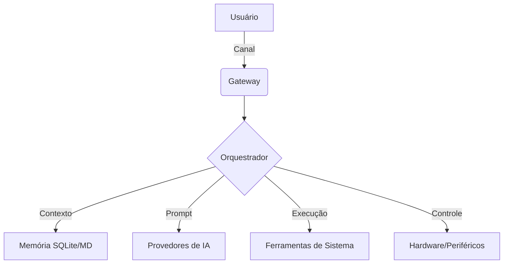

<p align="center">
  
  
  
  
</p>

<h1 align="center">nullclaw</h1>

<p align="center">
  <strong>O assistente de IA mais minimalista e de alto desempenho para o seu terminal</strong><br>
  <sub>Escrito em Zig puro. Zero dependências. Portabilidade máxima. Segurança por design.</sub>
</p>

<p align="center">
  <a href="#-recursos">Recursos</a> •
  <a href="#-benchmarks">Benchmarks</a> •
  <a href="#-arquitetura">Arquitetura</a> •
  <a href="#-segurança">Segurança</a> •
  <a href="#-início-rápido">Início Rápido</a> •
  <a href="#-uso">Uso</a> •
  <a href="#-configuração">Configuração</a>
</p>

---

## ✨ Recursos

- **⚡ Desempenho Extremo** — Escrito em Zig para velocidade nativa e previsibilidade de memória.
- **📦 Pegada Mínima** — Binário com menos de 1 MB (ReleaseSmall), usando menos de 5 MB de RAM.
- **🛡️ Segurança Primeiro** — Sandbox nativo, pareamento seguro de dispositivos e criptografia AEAD.
- **🔌 Arquitetura VTable** — Sistema de plugins modular para Provedores de IA, Canais, Ferramentas e Memória.
- **🌐 Multiprovedor** — Suporte nativo para OpenAI, Anthropic, Gemini, Mistral, Groq e mais de 40 outros via endpoints compatíveis.
- **💬 Multicanal** — Interaja via Terminal, Discord, Telegram, WhatsApp, Slack e Web.
- **🛠️ Extensível** — Adicione novas habilidades, ferramentas e integrações de hardware com facilidade.
- **🧩 Autônomo** — Pode rodar de forma independente ou como parte de uma rede OpenClaw.

---

## 📊 Benchmarks

Comparação de recursos e desempenho com outros assistentes de IA populares:

| Métrica | nullclaw | ZeroClaw (Rust) | OpenClaw (Node) |
|---------|----------|-----------------|-----------------|
| **Tamanho do Binário** | **< 1 MB** | ~25 MB | N/A (Node.js) |
| **Uso de Memória** | **< 5 MB** | ~40 MB | ~150 MB |
| **Tempo de Inicialização** | **< 10ms** | ~50ms | ~800ms |
| **Dependências** | **0** | ~150 | ~1,200 |
| **Linguagem** | **Zig** | Rust | TypeScript/JS |

> *Nota: Benchmarks realizados em um M2 MacBook Air.*

---

## 🏗 Arquitetura

O `nullclaw` é construído sobre uma base modular e orientada a vtables, garantindo rigidez onde necessário e flexibilidade onde importa.



### Principais Pontos de Extensão

- **Provedores (`Provider`)** — Integre qualquer modelo de IA via APIs HTTP.
- **Canais (`Channel`)** — Adicione novas interfaces de comunicação.
- **Ferramentas (`Tool`)** — Permita que a IA execute código, acesse arquivos ou controle sistemas.
- **Memória (`Memory`)** — Backends para armazenamento de histórico e busca vetorial.
- **Periféricos (`Peripheral`)** — Controle direto de hardware (Arduino, ESP32, RPi).

---

## 🛡 Segurança

Segurança não é um recurso adicionado depois; é a fundação:

- **Sandbox Nativo** — Ferramentas executadas em ambientes isolados (chroot/jail no Linux, sandbox-exec no macOS).
- **Criptografia AEAD** — Todas as comunicações de rede e dados sensíveis em repouso são protegidos com ChaCha20-Poly1305.
- **Pareamento Seguro** — Dispositivos externos requerem pareamento explícito e troca de segredos.
- **Sem Telemetria** — Seus dados, suas chaves e suas conversas nunca saem do seu controle.

---

## 🚀 Início Rápido

### Instalação (Pré-compilado)

Baixe a versão mais recente para o seu sistema na [página de Releases](https://github.com/nullclaw/nullclaw/releases).

```bash
# Exemplo para Linux/macOS
curl -L https://github.com/nullclaw/nullclaw/releases/latest/download/nullclaw-$(uname -s)-$(uname -m) -o nullclaw
chmod +x nullclaw
mv nullclaw /usr/local/bin/
```

### Compilando do Código Fonte

Requer [Zig 0.15.2](https://ziglang.org/download/).

```bash
git clone https://github.com/nullclaw/nullclaw
cd nullclaw
zig build -Doptimize=ReleaseSmall
```

O binário será gerado em `./zig-out/bin/nullclaw`.

---

## 💻 Uso

### Configuração Inicial

Execute o assistente de configuração interativo:

```bash
nullclaw onboard
```

### Iniciando o Assistente

```bash
nullclaw start
```

### Comandos Rápidos

```bash
nullclaw chat "Como faço para listar arquivos no Zig?"
nullclaw skills list
nullclaw health
```

---

## ⚙️ Configuração

O arquivo de configuração reside em `~/.nullclaw/config.json`. Exemplo básico:

```json
{
  "name": "Claw",
  "provider": {
    "default": "openai",
    "openai": {
      "api_key": "sk-...",
      "model": "gpt-4o"
    }
  },
  "channels": {
    "terminal": { "enabled": true },
    "discord": {
      "enabled": false,
      "token": "..."
    }
  }
}
```

Para uma referência completa de todas as chaves e provedores suportados, consulte [CONFIGURACAO.md](./docs/CONFIGURACAO.md).

---

## 📄 Licença

MIT © [nullclaw contributors](https://github.com/nullclaw/nullclaw/graphs/contributors)
